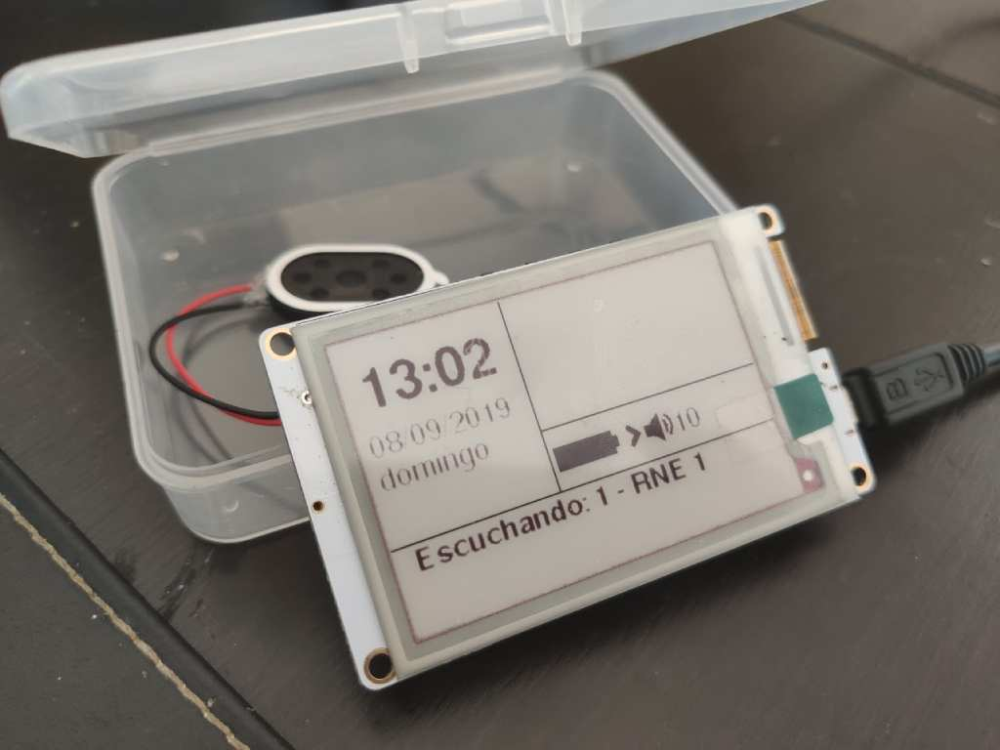

# [WIP]iArradio

## An Internet Radio based on TTGO-T5s EPaper module

The module can be purchased [Here](https://es.aliexpress.com/item/32867880658.html?spm=a2g0s.9042311.0.0.27a363c0QivmD3). Choose the B/W version (displayed as 2.7 inch) do not purchase B/W and Red version, so the display refresh will be faster and more usable.

Developed with [PlatformIO](https://platformio.org/)

Libraries used:
 - [GxEPD2](https://github.com/ZinggJM/GxEPD2) 
 - [Adafruit_GFX](https://github.com/adafruit/Adafruit-GFX-Library)
 - [ESP32-audioI2S](https://github.com/schreibfaul1/ESP32-audioI2S.git)
 - [ArduinoJson](https://github.com/bblanchon/ArduinoJson)
 - [NTP](https://github.com/sstaub/NTP)
 - [WIFIMANAGER-ESP32](https://github.com/zhouhan0126/WIFIMANAGER-ESP32)
   - [Web Server](https://github.com/zhouhan0126/WebServer-esp32)
   - [DNS Server](https://github.com/zhouhan0126/DNSServer---esp32)
 - [EasyButton](https://github.com/evert-arias/EasyButton)

 ## Current Status
 Radio works, display works, user can change volume and station. Only retrieve and display weather information left. Still work in progress.

 ## Icons and Fonts
 All icons and fonts used in this project has been generated or included in:
  - [Adafruit GFX Library](https://learn.adafruit.com/adafruit-gfx-graphics-library/using-fonts)
  - [Fontello font converter](http://fontello.com/) This allows me to generate a custom font with only needed icons and mapped to Adafruit's char range.
  - [TrueType to GFX](https://rop.nl/truetype2gfx/) This converts TTF generated with Fontello in to header files to include in the project.

The Adafruit fonts are from [GNU FREE Font Project](https://www.gnu.org/software/freefont/)
The fonts generated with Fontello are [SIL](http://scripts.sil.org/cms/scripts/page.php?item_id=OFL_web) licensed
