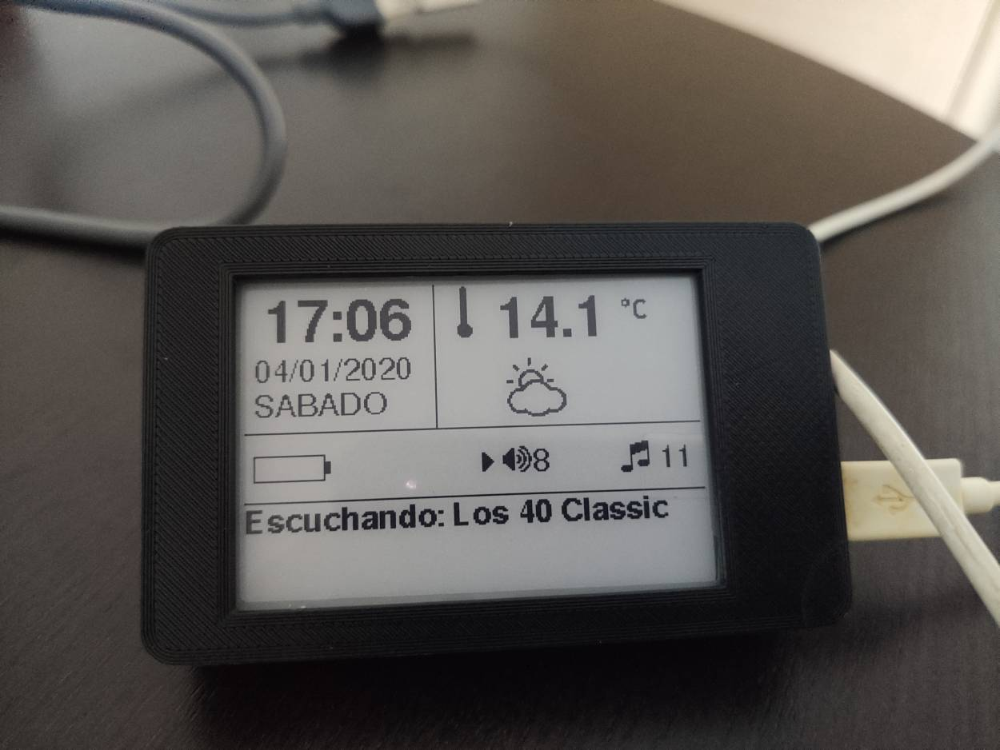

# iArradio

## An Internet Radio based on TTGO-T5s EPaper module

The module can be purchased [Here](https://es.aliexpress.com/item/32867880658.html?spm=a2g0s.9042311.0.0.27a363c0QivmD3). Choose the B/W version (displayed as 2.7 inch) do not purchase B/W and Red version, so the display refresh will be faster and more usable.

Developed with [PlatformIO](https://platformio.org/)

Libraries used:

- [GxEPD2](https://github.com/ZinggJM/GxEPD2)
- [Adafruit_GFX](https://github.com/adafruit/Adafruit-GFX-Library)
- [ESP32-audioI2S](https://github.com/schreibfaul1/ESP32-audioI2S.git)
- [ArduinoJson](https://github.com/bblanchon/ArduinoJson)
- [NTP](https://github.com/sstaub/NTP)
- [WifiManager](https://github.com/tzapu/WiFiManager.git)
- [EasyButton](https://github.com/evert-arias/EasyButton)

## Current Status

Fully functional

## Hardware

Just add a Lithium battery and an speaker connected to speaker pins.

## Compile

Rename `includes/settings.example.hpp` to `includes/settings.hpp` and configure with your options. Translations are stored in `include/translations.hpp`. Stations list is in `includes/stations.hpp`. Any mp3/aac station will be played. Even playlists in m3u format. Everything will compile with [PlatformIO](https://platformio.org/). I've used VSCode to developing.

## Case

The case design it's not mine, you can download it from [Thingiverse](https://www.thingiverse.com/thing:4057992). It can fit the circuit, a 18650 battery and an small speaker.

## Usage

After starting up, a Wifi configuration hotspot will be available. Just connect to that hotspot and follow instructions to connect to your WiFi. Once connected to your WiFi, device will show the main screen. Leftmost button is to change mode from volume to station selection (a tick will show the one selected). The two middle buttons will increase and decrease the volume or selected station. By holding the leftmost button the configured `HOLD_TIMEOUT`, the radio will poweroff. To power on again, just press the rightmost button (reset).

## Icons and Fonts

All icons and fonts used in this project has been generated or included in:

- [Adafruit GFX Library](https://learn.adafruit.com/adafruit-gfx-graphics-library/using-fonts)
- [Fontello font converter](http://fontello.com/) This allows me to generate a custom font with only needed icons and mapped to Adafruit's char range.
- [TrueType to GFX](https://rop.nl/truetype2gfx/) This converts TTF generated with Fontello in to header files to include in the project.

The Adafruit fonts are from [GNU FREE Font Project](https://www.gnu.org/software/freefont/)
The fonts generated with Fontello are [SIL](http://scripts.sil.org/cms/scripts/page.php?item_id=OFL_web) licensed
